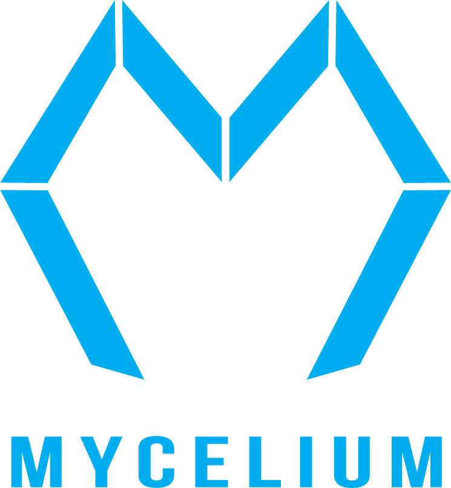

# Red October
Docs 3-9-23 V1 (For questions or comments:  Stephen Witty switty@level500.com)  

### Project Overview:
The Red October Project collected detailed scans of the Helium LoRa network located in North West AR.  The scans tie Helium LoRa network hotspots and their various attributes, such as signal strength, to GPS coordinates.  This allows users of the scan dataset to run simulations with the LoRa footprint without the need to physically be in the area.  Since the dataset is static, it also allows for reproducibility not possible with the physical network due to constantly changing configurations.  The scan data was collected over a 50-mile loop connecting Bentonville, AR to Fayetteville, AR using College Street and I49.  Over the drive loop, data was collected every 20 seconds for 90 minutes and transmitted over the Helium LoRa network tieing GPS position to LoRa hotspots.  The geographic scan area is widely known as the Mycelium testbed since Mycelium Networks deployed much of the hotspot infrastructure to the area.  The scan data can be found in the Data folder of this repository.

### Why is the project called Red October?
In the movie, The Hunt for Red October, the Russians had hyper-accurate surveys of a ridge known as Reykjanes Ridge. This allowed Russian submarines to navigate the ridge at high speed without the need for additional navigation equipment. The LoRa scans are reminiscent of this part of the movie.

### How was the data collected?
A RAK4631 MCU with a corresponding GPS module was used to collect the data and transmit it over Helium LoRa.  The source code for the RAK4631 can be found under Arudino_Source.  The data was transmitted to the Helium Console, where a function was used to decode the GPS coordinates and add a timestamp.  A Helium console webhook was then used to send the data to a web server where the data was recorded.

### What format is the data in?
The data is in a JSON file.  The format of the data is exactly the same as an application would see when using the Helium console.  The various Helium keys have been replaced with FFFFFFF.  The GPS coordinates have been added as a payload for each 20-second transmission.    The added timestamp is Unix Epoch time.

### When was the data collected?
March 9th, 2023 at 8:30 am central for 90 minutes. 

### What is in the script folder?
These are utility scripts used to collect the data and process it.  This, as well as the Arduino source, can be ignored to use the dataset.

### Why not just use the Helium Mapper Project data?
While the Mapper project must be collecting similar data, there is no obvious way to export the raw data from the Mapper project. Since the primary goal of the Mapper project is to provide coverage maps, the raw input data may not be available. Collecting the data for this project also allowed desirable location and frequency targeting.

### Many thanks:

- The Mycelium Networks Builder Program for support and encouragement
- RAK Wisblock for excellent hardware offerings and code examples
- The Helium Foundation for their efforts in creating the network

